# Takakrypt System Flow Documentation

## Overview

This document provides comprehensive flow diagrams and explanations for all major operations within the Takakrypt transparent encryption system. It covers file operations, policy evaluation, encryption/decryption processes, and system interactions.

## Table of Contents

1. [File Operation Flows](#file-operation-flows)
2. [Policy Evaluation Flows](#policy-evaluation-flows)
3. [Encryption/Decryption Flows](#encryptiondecryption-flows)
4. [Agent Startup and Initialization](#agent-startup-and-initialization)
5. [Error Handling and Recovery Flows](#error-handling-and-recovery-flows)
6. [Cache Management Flows](#cache-management-flows)
7. [KMS Integration Flows](#kms-integration-flows)
8. [Monitoring and Health Check Flows](#monitoring-and-health-check-flows)

---

## File Operation Flows

### Primary Path: Stackable Filesystem (takakryptfs)

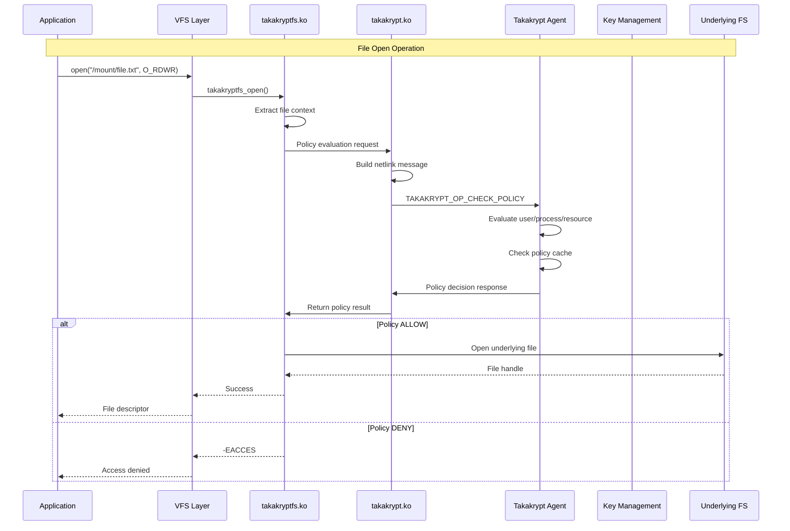
```mermaid
sequenceDiagram
    participant App as Application
    participant VFS as VFS Layer
    participant TFS as takakryptfs.ko
    participant TK as takakrypt.ko
    participant Agent as Takakrypt Agent
    participant KMS as Key Management
    participant FS as Underlying FS

    Note over App,FS: File Open Operation
    App->>VFS: open("/mount/file.txt", O_RDWR)
    VFS->>TFS: takakryptfs_open()
    
    TFS->>TFS: Extract file context
    TFS->>TK: Policy evaluation request
    TK->>TK: Build netlink message
    TK->>Agent: TAKAKRYPT_OP_CHECK_POLICY
    
    Agent->>Agent: Evaluate user/process/resource
    Agent->>Agent: Check policy cache
    Agent->>TK: Policy decision response
    TK->>TFS: Return policy result
    
    alt Policy ALLOW
        TFS->>FS: Open underlying file
        FS-->>TFS: File handle
        TFS-->>VFS: Success
        VFS-->>App: File descriptor
    else Policy DENY
        TFS-->>VFS: -EACCES
        VFS-->>App: Access denied
    end
```

### File Read Operation Flow

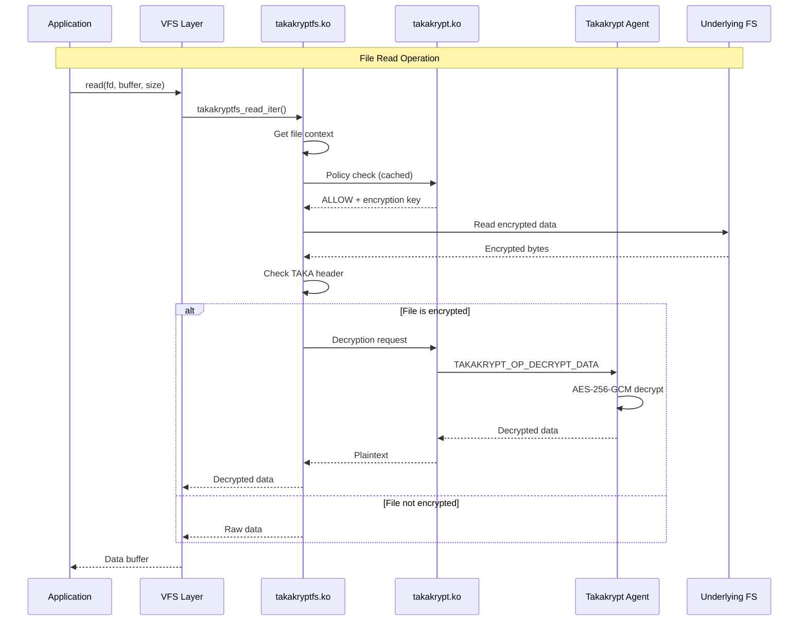
```mermaid
sequenceDiagram
    participant App as Application
    participant VFS as VFS Layer
    participant TFS as takakryptfs.ko
    participant TK as takakrypt.ko
    participant Agent as Takakrypt Agent
    participant FS as Underlying FS

    Note over App,FS: File Read Operation
    App->>VFS: read(fd, buffer, size)
    VFS->>TFS: takakryptfs_read_iter()
    
    TFS->>TFS: Get file context
    TFS->>TK: Policy check (cached)
    TK-->>TFS: ALLOW + encryption key
    
    TFS->>FS: Read encrypted data
    FS-->>TFS: Encrypted bytes
    
    TFS->>TFS: Check TAKA header
    alt File is encrypted
        TFS->>TK: Decryption request
        TK->>Agent: TAKAKRYPT_OP_DECRYPT_DATA
        Agent->>Agent: AES-256-GCM decrypt
        Agent-->>TK: Decrypted data
        TK-->>TFS: Plaintext
        TFS-->>VFS: Decrypted data
    else File not encrypted
        TFS-->>VFS: Raw data
    end
    
    VFS-->>App: Data buffer
```

### File Write Operation Flow

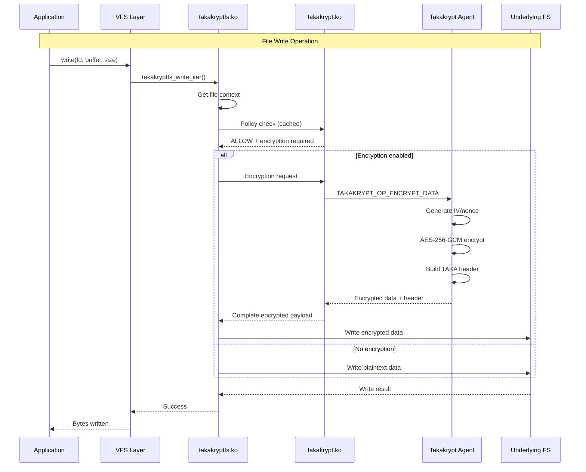
```mermaid
sequenceDiagram
    participant App as Application
    participant VFS as VFS Layer
    participant TFS as takakryptfs.ko
    participant TK as takakrypt.ko
    participant Agent as Takakrypt Agent
    participant FS as Underlying FS

    Note over App,FS: File Write Operation
    App->>VFS: write(fd, buffer, size)
    VFS->>TFS: takakryptfs_write_iter()
    
    TFS->>TFS: Get file context
    TFS->>TK: Policy check (cached)
    TK-->>TFS: ALLOW + encryption required
    
    alt Encryption enabled
        TFS->>TK: Encryption request
        TK->>Agent: TAKAKRYPT_OP_ENCRYPT_DATA
        Agent->>Agent: Generate IV/nonce
        Agent->>Agent: AES-256-GCM encrypt
        Agent->>Agent: Build TAKA header
        Agent-->>TK: Encrypted data + header
        TK-->>TFS: Complete encrypted payload
        TFS->>FS: Write encrypted data
    else No encryption
        TFS->>FS: Write plaintext data
    end
    
    FS-->>TFS: Write result
    TFS-->>VFS: Success
    VFS-->>App: Bytes written
```

### Fallback Path: kprobe Hooks

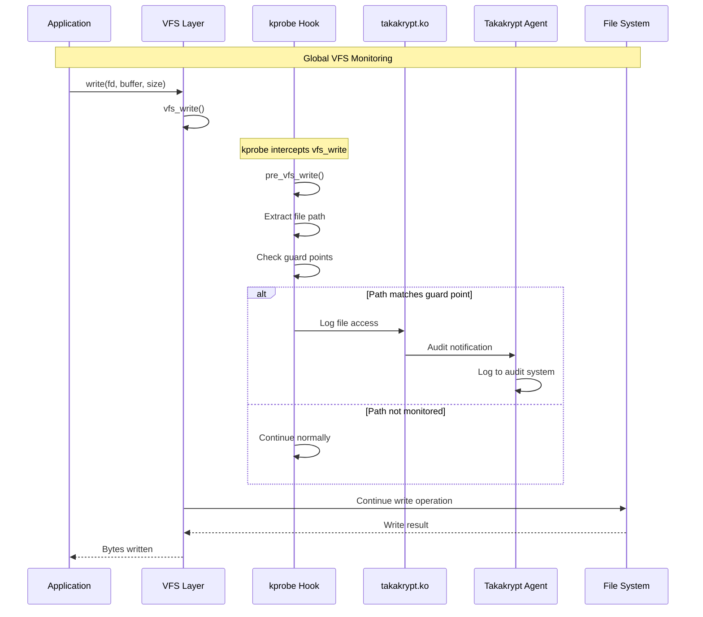
```mermaid
sequenceDiagram
    participant App as Application
    participant VFS as VFS Layer
    participant KP as kprobe Hook
    participant TK as takakrypt.ko
    participant Agent as Takakrypt Agent
    participant FS as File System

    Note over App,FS: Global VFS Monitoring
    App->>VFS: write(fd, buffer, size)
    VFS->>VFS: vfs_write()
    
    Note over KP: kprobe intercepts vfs_write
    KP->>KP: pre_vfs_write()
    KP->>KP: Extract file path
    KP->>KP: Check guard points
    
    alt Path matches guard point
        KP->>TK: Log file access
        TK->>Agent: Audit notification
        Agent->>Agent: Log to audit system
    else Path not monitored
        KP->>KP: Continue normally
    end
    
    VFS->>FS: Continue write operation
    FS-->>VFS: Write result
    VFS-->>App: Bytes written
```

---

## Policy Evaluation Flows

### Complex Policy Evaluation

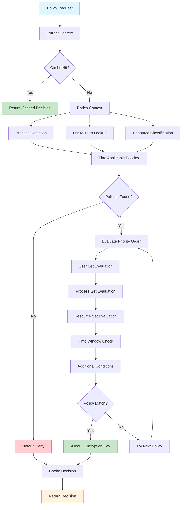
```mermaid
flowchart TD
    A[Policy Request] --> B[Extract Context]
    B --> C{Cache Hit?}
    C -->|Yes| D[Return Cached Decision]
    C -->|No| E[Enrich Context]
    
    E --> F[Process Detection]
    E --> G[User/Group Lookup]
    E --> H[Resource Classification]
    
    F --> I[Find Applicable Policies]
    G --> I
    H --> I
    
    I --> J{Policies Found?}
    J -->|No| K[Default Deny]
    J -->|Yes| L[Evaluate Priority Order]
    
    L --> M[User Set Evaluation]
    M --> N[Process Set Evaluation]
    N --> O[Resource Set Evaluation]
    O --> P[Time Window Check]
    P --> Q[Additional Conditions]
    
    Q --> R{Policy Match?}
    R -->|Yes| S[Allow + Encryption Key]
    R -->|No| T[Try Next Policy]
    T --> L
    
    S --> U[Cache Decision]
    K --> U
    U --> V[Return Decision]
    
    style A fill:#e1f5fe
    style D fill:#c8e6c9
    style S fill:#c8e6c9
    style K fill:#ffcdd2
    style V fill:#fff3e0
```

### Database Process Detection

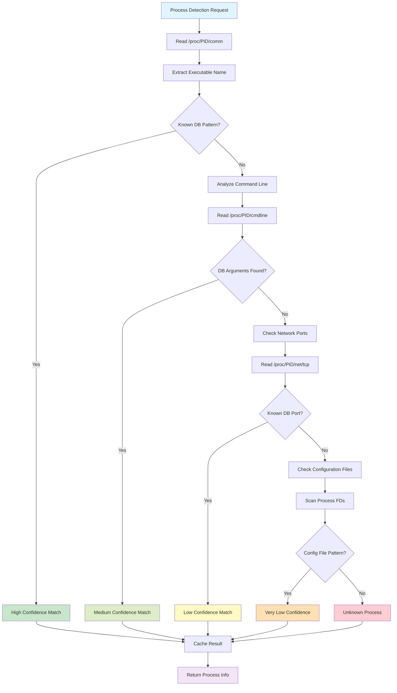
```mermaid
flowchart TD
    A[Process Detection Request] --> B[Read /proc/PID/comm]
    B --> C[Extract Executable Name]
    
    C --> D{Known DB Pattern?}
    D -->|Yes| E[High Confidence Match]
    D -->|No| F[Analyze Command Line]
    
    F --> G[Read /proc/PID/cmdline]
    G --> H{DB Arguments Found?}
    H -->|Yes| I[Medium Confidence Match]
    H -->|No| J[Check Network Ports]
    
    J --> K[Read /proc/PID/net/tcp]
    K --> L{Known DB Port?}
    L -->|Yes| M[Low Confidence Match]
    L -->|No| N[Check Configuration Files]
    
    N --> O[Scan Process FDs]
    O --> P{Config File Pattern?}
    P -->|Yes| Q[Very Low Confidence]
    P -->|No| R[Unknown Process]
    
    E --> S[Cache Result]
    I --> S
    M --> S
    Q --> S
    R --> S
    S --> T[Return Process Info]
    
    style A fill:#e1f5fe
    style E fill:#c8e6c9
    style I fill:#dcedc8
    style M fill:#fff9c4
    style Q fill:#ffe0b2
    style R fill:#ffcdd2
    style T fill:#f3e5f5
```

### User Set Evaluation

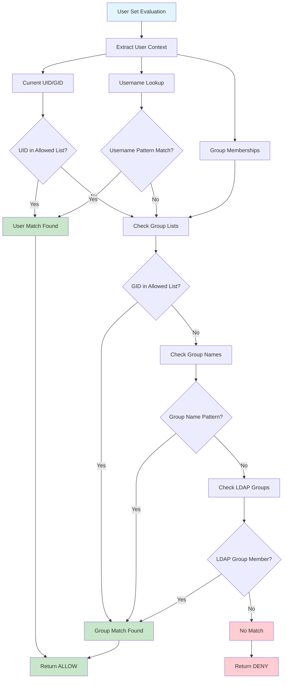
```mermaid
flowchart TD
    A[User Set Evaluation] --> B[Extract User Context]
    B --> C[Current UID/GID]
    B --> D[Username Lookup]
    B --> E[Group Memberships]
    
    C --> F{UID in Allowed List?}
    F -->|Yes| G[User Match Found]
    F -->|No| H[Check Group Lists]
    
    D --> I{Username Pattern Match?}
    I -->|Yes| G
    I -->|No| H
    
    E --> H
    H --> J{GID in Allowed List?}
    J -->|Yes| K[Group Match Found]
    J -->|No| L[Check Group Names]
    
    L --> M{Group Name Pattern?}
    M -->|Yes| K
    M -->|No| N[Check LDAP Groups]
    
    N --> O{LDAP Group Member?}
    O -->|Yes| K
    O -->|No| P[No Match]
    
    G --> Q[Return ALLOW]
    K --> Q
    P --> R[Return DENY]
    
    style A fill:#e1f5fe
    style G fill:#c8e6c9
    style K fill:#c8e6c9
    style Q fill:#c8e6c9
    style P fill:#ffcdd2
    style R fill:#ffcdd2
```

---

## Encryption/Decryption Flows

### File Encryption Process

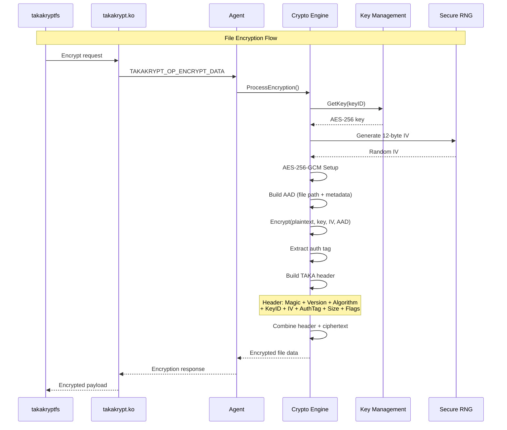
```mermaid
sequenceDiagram
    participant TFS as takakryptfs
    participant TK as takakrypt.ko
    participant Agent as Agent
    participant Crypto as Crypto Engine
    participant KMS as Key Management
    participant RNG as Secure RNG

    Note over TFS,RNG: File Encryption Flow
    TFS->>TK: Encrypt request
    TK->>Agent: TAKAKRYPT_OP_ENCRYPT_DATA
    
    Agent->>Crypto: ProcessEncryption()
    Crypto->>KMS: GetKey(keyID)
    KMS-->>Crypto: AES-256 key
    
    Crypto->>RNG: Generate 12-byte IV
    RNG-->>Crypto: Random IV
    
    Crypto->>Crypto: AES-256-GCM Setup
    Crypto->>Crypto: Build AAD (file path + metadata)
    Crypto->>Crypto: Encrypt(plaintext, key, IV, AAD)
    Crypto->>Crypto: Extract auth tag
    
    Crypto->>Crypto: Build TAKA header
    Note over Crypto: Header: Magic + Version + Algorithm<br/>+ KeyID + IV + AuthTag + Size + Flags
    
    Crypto->>Crypto: Combine header + ciphertext
    Crypto-->>Agent: Encrypted file data
    Agent-->>TK: Encryption response
    TK-->>TFS: Encrypted payload
```

### File Decryption Process

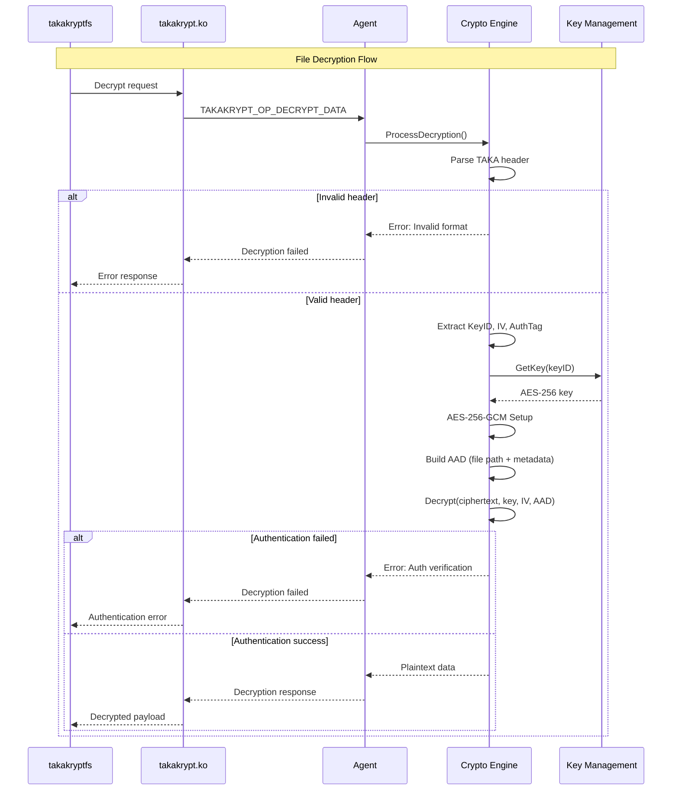
```mermaid
sequenceDiagram
    participant TFS as takakryptfs
    participant TK as takakrypt.ko
    participant Agent as Agent
    participant Crypto as Crypto Engine
    participant KMS as Key Management

    Note over TFS,KMS: File Decryption Flow
    TFS->>TK: Decrypt request
    TK->>Agent: TAKAKRYPT_OP_DECRYPT_DATA
    
    Agent->>Crypto: ProcessDecryption()
    Crypto->>Crypto: Parse TAKA header
    
    alt Invalid header
        Crypto-->>Agent: Error: Invalid format
        Agent-->>TK: Decryption failed
        TK-->>TFS: Error response
    else Valid header
        Crypto->>Crypto: Extract KeyID, IV, AuthTag
        Crypto->>KMS: GetKey(keyID)
        KMS-->>Crypto: AES-256 key
        
        Crypto->>Crypto: AES-256-GCM Setup
        Crypto->>Crypto: Build AAD (file path + metadata)
        Crypto->>Crypto: Decrypt(ciphertext, key, IV, AAD)
        
        alt Authentication failed
            Crypto-->>Agent: Error: Auth verification
            Agent-->>TK: Decryption failed
            TK-->>TFS: Authentication error
        else Authentication success
            Crypto-->>Agent: Plaintext data
            Agent-->>TK: Decryption response
            TK-->>TFS: Decrypted payload
        end
    end
```

### TAKA File Format Processing

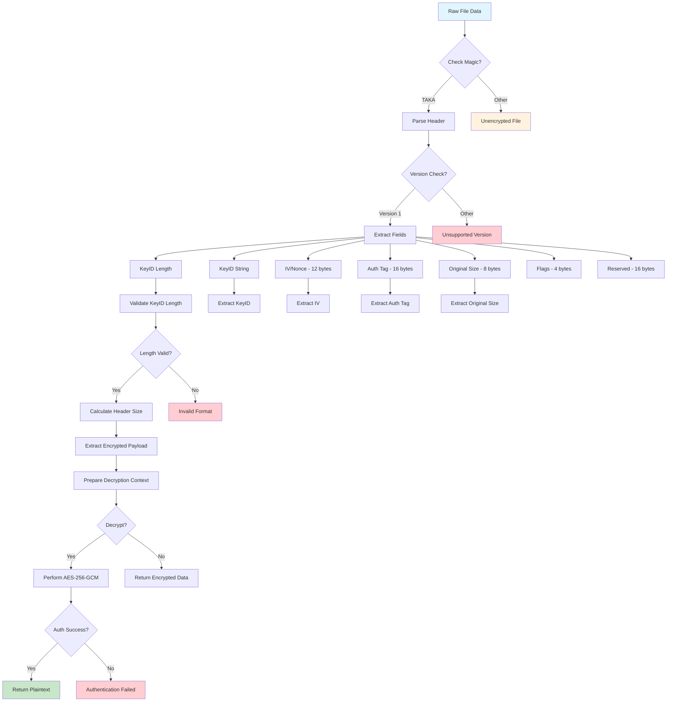
```mermaid
flowchart TD
    A[Raw File Data] --> B{Check Magic?}
    B -->|"TAKA"| C[Parse Header]
    B -->|Other| D[Unencrypted File]
    
    C --> E{Version Check?}
    E -->|Version 1| F[Extract Fields]
    E -->|Other| G[Unsupported Version]
    
    F --> H[KeyID Length]
    F --> I[KeyID String]
    F --> J[IV/Nonce - 12 bytes]
    F --> K[Auth Tag - 16 bytes]
    F --> L[Original Size - 8 bytes]
    F --> M[Flags - 4 bytes]
    F --> N[Reserved - 16 bytes]
    
    H --> O[Validate KeyID Length]
    I --> P[Extract KeyID]
    J --> Q[Extract IV]
    K --> R[Extract Auth Tag]
    L --> S[Extract Original Size]
    
    O --> T{Length Valid?}
    T -->|Yes| U[Calculate Header Size]
    T -->|No| V[Invalid Format]
    
    U --> W[Extract Encrypted Payload]
    W --> X[Prepare Decryption Context]
    
    X --> Y{Decrypt?}
    Y -->|Yes| Z[Perform AES-256-GCM]
    Y -->|No| AA[Return Encrypted Data]
    
    Z --> BB{Auth Success?}
    BB -->|Yes| CC[Return Plaintext]
    BB -->|No| DD[Authentication Failed]
    
    style A fill:#e1f5fe
    style D fill:#fff3e0
    style CC fill:#c8e6c9
    style DD fill:#ffcdd2
    style G fill:#ffcdd2
    style V fill:#ffcdd2
```

---

## Agent Startup and Initialization

### Agent Bootstrap Process

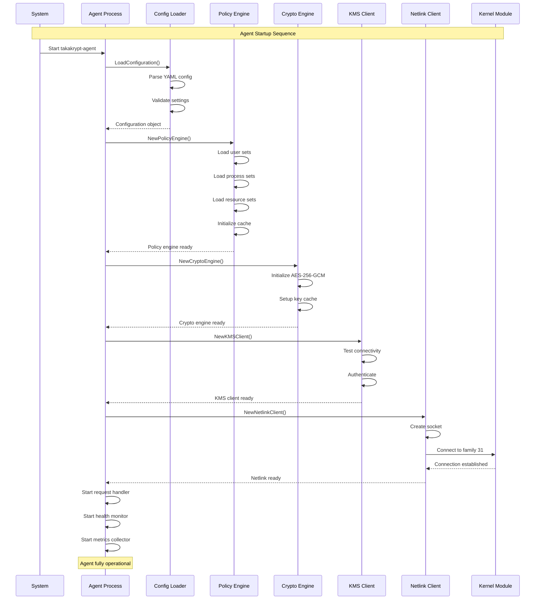
```mermaid
sequenceDiagram
    participant Sys as System
    participant Agent as Agent Process
    participant Config as Config Loader
    participant Policy as Policy Engine
    participant Crypto as Crypto Engine
    participant KMS as KMS Client
    participant Netlink as Netlink Client
    participant Kernel as Kernel Module

    Note over Sys,Kernel: Agent Startup Sequence
    Sys->>Agent: Start takakrypt-agent
    Agent->>Config: LoadConfiguration()
    Config->>Config: Parse YAML config
    Config->>Config: Validate settings
    Config-->>Agent: Configuration object
    
    Agent->>Policy: NewPolicyEngine()
    Policy->>Policy: Load user sets
    Policy->>Policy: Load process sets
    Policy->>Policy: Load resource sets
    Policy->>Policy: Initialize cache
    Policy-->>Agent: Policy engine ready
    
    Agent->>Crypto: NewCryptoEngine()
    Crypto->>Crypto: Initialize AES-256-GCM
    Crypto->>Crypto: Setup key cache
    Crypto-->>Agent: Crypto engine ready
    
    Agent->>KMS: NewKMSClient()
    KMS->>KMS: Test connectivity
    KMS->>KMS: Authenticate
    KMS-->>Agent: KMS client ready
    
    Agent->>Netlink: NewNetlinkClient()
    Netlink->>Netlink: Create socket
    Netlink->>Kernel: Connect to family 31
    Kernel-->>Netlink: Connection established
    Netlink-->>Agent: Netlink ready
    
    Agent->>Agent: Start request handler
    Agent->>Agent: Start health monitor
    Agent->>Agent: Start metrics collector
    
    Note over Agent: Agent fully operational
```

### Module Loading and Initialization

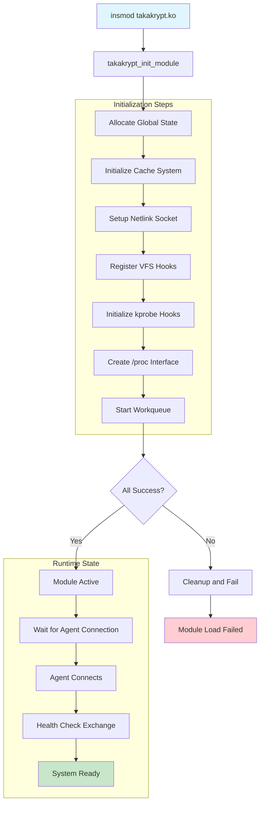
```mermaid
flowchart TD
    A[insmod takakrypt.ko] --> B[takakrypt_init_module]
    B --> C[Allocate Global State]
    C --> D[Initialize Cache System]
    D --> E[Setup Netlink Socket]
    E --> F[Register VFS Hooks]
    F --> G[Initialize kprobe Hooks]
    G --> H[Create /proc Interface]
    H --> I[Start Workqueue]
    I --> J{All Success?}
    
    J -->|Yes| K[Module Active]
    J -->|No| L[Cleanup and Fail]
    
    K --> M[Wait for Agent Connection]
    M --> N[Agent Connects]
    N --> O[Health Check Exchange]
    O --> P[System Ready]
    
    L --> Q[Module Load Failed]
    
    style A fill:#e1f5fe
    style P fill:#c8e6c9
    style Q fill:#ffcdd2
    
    subgraph "Initialization Steps"
        C
        D
        E
        F
        G
        H
        I
    end
    
    subgraph "Runtime State"
        K
        M
        N
        O
        P
    end
```

---

## Error Handling and Recovery Flows

### Agent Recovery Process

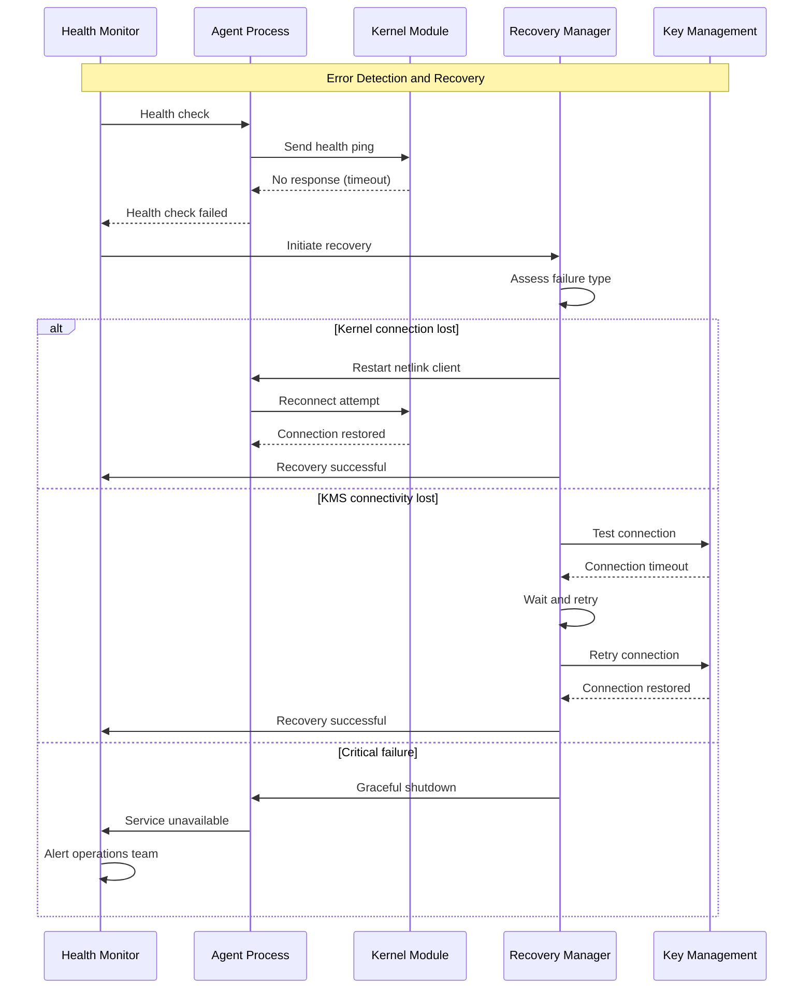
```mermaid
sequenceDiagram
    participant Monitor as Health Monitor
    participant Agent as Agent Process
    participant Kernel as Kernel Module
    participant Recovery as Recovery Manager
    participant KMS as Key Management

    Note over Monitor,KMS: Error Detection and Recovery
    Monitor->>Agent: Health check
    Agent->>Kernel: Send health ping
    Kernel-->>Agent: No response (timeout)
    Agent-->>Monitor: Health check failed
    
    Monitor->>Recovery: Initiate recovery
    Recovery->>Recovery: Assess failure type
    
    alt Kernel connection lost
        Recovery->>Agent: Restart netlink client
        Agent->>Kernel: Reconnect attempt
        Kernel-->>Agent: Connection restored
        Recovery->>Monitor: Recovery successful
    else KMS connectivity lost
        Recovery->>KMS: Test connection
        KMS-->>Recovery: Connection timeout
        Recovery->>Recovery: Wait and retry
        Recovery->>KMS: Retry connection
        KMS-->>Recovery: Connection restored
        Recovery->>Monitor: Recovery successful
    else Critical failure
        Recovery->>Agent: Graceful shutdown
        Agent->>Monitor: Service unavailable
        Monitor->>Monitor: Alert operations team
    end
```

### Circuit Breaker Pattern

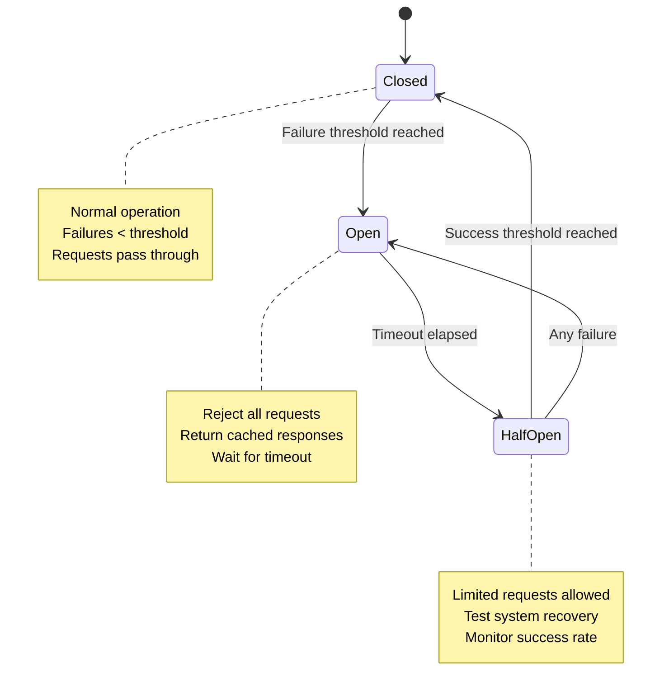
```mermaid
stateDiagram-v2
    [*] --> Closed
    
    Closed --> Open : Failure threshold reached
    Open --> HalfOpen : Timeout elapsed
    HalfOpen --> Closed : Success threshold reached
    HalfOpen --> Open : Any failure
    
    note right of Closed
        Normal operation
        Failures < threshold
        Requests pass through
    end note
    
    note right of Open
        Reject all requests
        Return cached responses
        Wait for timeout
    end note
    
    note right of HalfOpen
        Limited requests allowed
        Test system recovery
        Monitor success rate
    end note
```

### Graceful Degradation

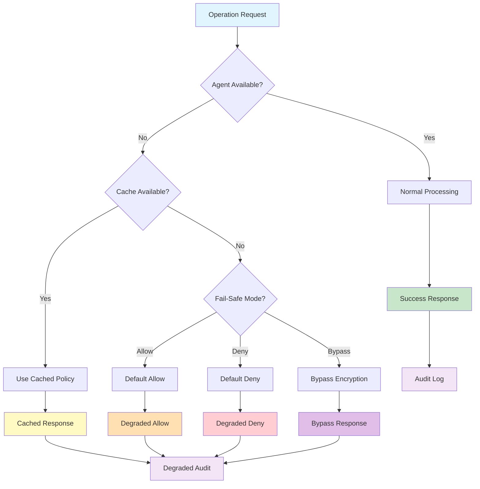
```mermaid
flowchart TD
    A[Operation Request] --> B{Agent Available?}
    B -->|Yes| C[Normal Processing]
    B -->|No| D{Cache Available?}
    
    D -->|Yes| E[Use Cached Policy]
    D -->|No| F{Fail-Safe Mode?}
    
    F -->|Allow| G[Default Allow]
    F -->|Deny| H[Default Deny]
    F -->|Bypass| I[Bypass Encryption]
    
    C --> J[Success Response]
    E --> K[Cached Response]
    G --> L[Degraded Allow]
    H --> M[Degraded Deny]
    I --> N[Bypass Response]
    
    J --> O[Audit Log]
    K --> P[Degraded Audit]
    L --> P
    M --> P
    N --> P
    
    style A fill:#e1f5fe
    style J fill:#c8e6c9
    style K fill:#fff9c4
    style L fill:#ffe0b2
    style M fill:#ffcdd2
    style N fill:#e1bee7
    style O fill:#f3e5f5
    style P fill:#f3e5f5
```

---

## Cache Management Flows

### Multi-Level Cache Architecture

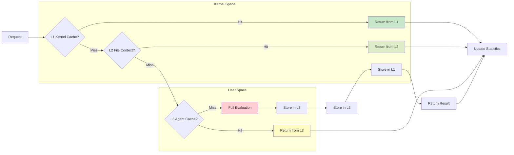
```mermaid
flowchart LR
    A[Request] --> B{L1 Kernel Cache?}
    B -->|Hit| C[Return from L1]
    B -->|Miss| D{L2 File Context?}
    
    D -->|Hit| E[Return from L2]
    D -->|Miss| F{L3 Agent Cache?}
    
    F -->|Hit| G[Return from L3]
    F -->|Miss| H[Full Evaluation]
    
    H --> I[Store in L3]
    I --> J[Store in L2]
    J --> K[Store in L1]
    K --> L[Return Result]
    
    C --> M[Update Statistics]
    E --> M
    G --> M
    L --> M
    
    subgraph "Kernel Space"
        B
        D
        C
        E
        K
    end
    
    subgraph "User Space"
        F
        G
        H
        I
    end
    
    style C fill:#c8e6c9
    style E fill:#dcedc8
    style G fill:#fff9c4
    style H fill:#ffcdd2
```

### Cache Eviction Process

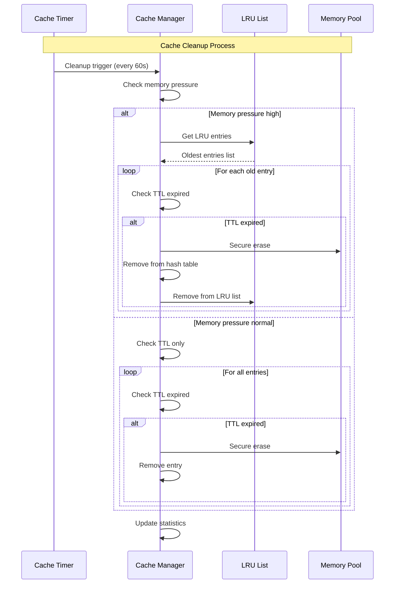
```mermaid
sequenceDiagram
    participant Timer as Cache Timer
    participant Cache as Cache Manager
    participant LRU as LRU List
    participant Memory as Memory Pool

    Note over Timer,Memory: Cache Cleanup Process
    Timer->>Cache: Cleanup trigger (every 60s)
    Cache->>Cache: Check memory pressure
    
    alt Memory pressure high
        Cache->>LRU: Get LRU entries
        LRU-->>Cache: Oldest entries list
        
        loop For each old entry
            Cache->>Cache: Check TTL expired
            alt TTL expired
                Cache->>Memory: Secure erase
                Cache->>Cache: Remove from hash table
                Cache->>LRU: Remove from LRU list
            end
        end
    else Memory pressure normal
        Cache->>Cache: Check TTL only
        
        loop For all entries
            Cache->>Cache: Check TTL expired
            alt TTL expired
                Cache->>Memory: Secure erase
                Cache->>Cache: Remove entry
            end
        end
    end
    
    Cache->>Cache: Update statistics
```

---

## KMS Integration Flows

### Key Retrieval Process

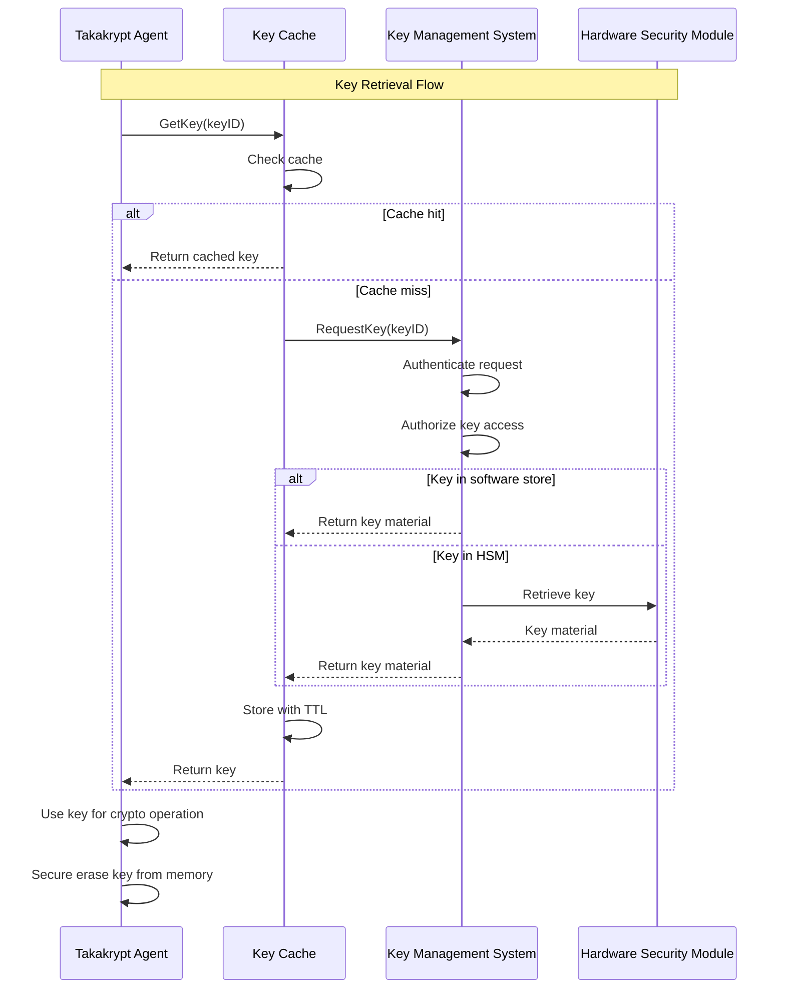
```mermaid
sequenceDiagram
    participant Agent as Takakrypt Agent
    participant Cache as Key Cache
    participant KMS as Key Management System
    participant HSM as Hardware Security Module

    Note over Agent,HSM: Key Retrieval Flow
    Agent->>Cache: GetKey(keyID)
    Cache->>Cache: Check cache
    
    alt Cache hit
        Cache-->>Agent: Return cached key
    else Cache miss
        Cache->>KMS: RequestKey(keyID)
        KMS->>KMS: Authenticate request
        KMS->>KMS: Authorize key access
        
        alt Key in software store
            KMS-->>Cache: Return key material
        else Key in HSM
            KMS->>HSM: Retrieve key
            HSM-->>KMS: Key material
            KMS-->>Cache: Return key material
        end
        
        Cache->>Cache: Store with TTL
        Cache-->>Agent: Return key
    end
    
    Agent->>Agent: Use key for crypto operation
    Agent->>Agent: Secure erase key from memory
```

### Key Rotation Process

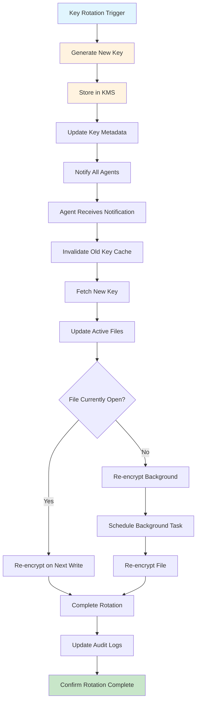
```mermaid
flowchart TD
    A[Key Rotation Trigger] --> B[Generate New Key]
    B --> C[Store in KMS]
    C --> D[Update Key Metadata]
    D --> E[Notify All Agents]
    
    E --> F[Agent Receives Notification]
    F --> G[Invalidate Old Key Cache]
    G --> H[Fetch New Key]
    H --> I[Update Active Files]
    
    I --> J{File Currently Open?}
    J -->|Yes| K[Re-encrypt on Next Write]
    J -->|No| L[Re-encrypt Background]
    
    K --> M[Complete Rotation]
    L --> N[Schedule Background Task]
    N --> O[Re-encrypt File]
    O --> M
    
    M --> P[Update Audit Logs]
    P --> Q[Confirm Rotation Complete]
    
    style A fill:#e1f5fe
    style B fill:#fff3e0
    style C fill:#fff3e0
    style Q fill:#c8e6c9
```

---

## Monitoring and Health Check Flows

### Health Check System

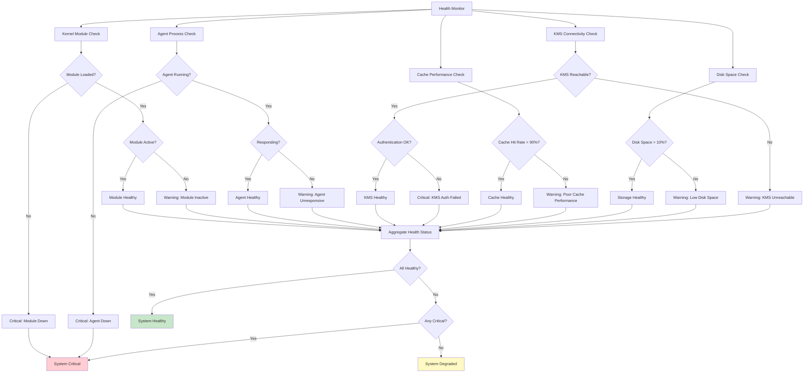
```mermaid
flowchart TD
    A[Health Monitor] --> B[Kernel Module Check]
    A --> C[Agent Process Check]
    A --> D[KMS Connectivity Check]
    A --> E[Cache Performance Check]
    A --> F[Disk Space Check]
    
    B --> G{Module Loaded?}
    G -->|Yes| H{Module Active?}
    G -->|No| I[Critical: Module Down]
    H -->|Yes| J[Module Healthy]
    H -->|No| K[Warning: Module Inactive]
    
    C --> L{Agent Running?}
    L -->|Yes| M{Responding?}
    L -->|No| N[Critical: Agent Down]
    M -->|Yes| O[Agent Healthy]
    M -->|No| P[Warning: Agent Unresponsive]
    
    D --> Q{KMS Reachable?}
    Q -->|Yes| R{Authentication OK?}
    Q -->|No| S[Warning: KMS Unreachable]
    R -->|Yes| T[KMS Healthy]
    R -->|No| U[Critical: KMS Auth Failed]
    
    E --> V{Cache Hit Rate > 90%?}
    V -->|Yes| W[Cache Healthy]
    V -->|No| X[Warning: Poor Cache Performance]
    
    F --> Y{Disk Space > 10%?}
    Y -->|Yes| Z[Storage Healthy]
    Y -->|No| AA[Warning: Low Disk Space]
    
    J --> BB[Aggregate Health Status]
    K --> BB
    O --> BB
    P --> BB
    T --> BB
    U --> BB
    W --> BB
    X --> BB
    Z --> BB
    AA --> BB
    I --> CC[System Critical]
    N --> CC
    S --> BB
    
    BB --> DD{All Healthy?}
    DD -->|Yes| EE[System Healthy]
    DD -->|No| FF{Any Critical?}
    
    FF -->|Yes| CC
    FF -->|No| GG[System Degraded]
    
    style EE fill:#c8e6c9
    style GG fill:#fff9c4
    style CC fill:#ffcdd2
```

### Performance Metrics Collection

```mermaid
sequenceDiagram
    participant Collector as Metrics Collector
    participant Kernel as Kernel Module
    participant Agent as Agent Process
    participant Prometheus as Prometheus
    participant AlertManager as Alert Manager

    Note over Collector,AlertManager: Metrics Collection Flow
    loop Every 30 seconds
        Collector->>Kernel: Read /proc/takakrypt/stats
        Kernel-->>Collector: Performance counters
        
        Collector->>Agent: Request internal metrics
        Agent-->>Collector: Policy/crypto/cache metrics
        
        Collector->>Collector: Process and aggregate
        Collector->>Prometheus: Export metrics
        
        Prometheus->>Prometheus: Evaluate alert rules
        
        alt Alert threshold breached
            Prometheus->>AlertManager: Fire alert
            AlertManager->>AlertManager: Route to operations
        end
    end
```

### Audit Trail Flow

```mermaid
flowchart TD
    A[File Operation] --> B[Policy Decision]
    B --> C[Crypto Operation]
    C --> D[Result]
    
    B --> E[Policy Audit Event]
    C --> F[Crypto Audit Event]
    D --> G[Access Audit Event]
    
    E --> H[Agent Audit Logger]
    F --> H
    G --> H
    
    H --> I[Format JSON Event]
    I --> J[Write to Local Log]
    I --> K[Send to SIEM]
    I --> L[Update Metrics]
    
    J --> M[Log Rotation]
    K --> N[SIEM Processing]
    L --> O[Prometheus Counters]
    
    N --> P[Security Analytics]
    N --> Q[Compliance Reporting]
    O --> R[Real-time Dashboards]
    
    style A fill:#e1f5fe
    style J fill:#fff3e0
    style K fill:#fff3e0
    style L fill:#fff3e0
    style P fill:#f3e5f5
    style Q fill:#f3e5f5
    style R fill:#f3e5f5
```

---

## System Integration Patterns

### Mount Point Integration

```mermaid
sequenceDiagram
    participant Admin as Administrator
    participant Mount as Mount Command
    participant VFS as VFS Layer
    participant TFS as takakryptfs
    participant TK as takakrypt.ko
    participant Agent as Agent

    Note over Admin,Agent: Encrypted Mount Setup
    Admin->>Mount: mount -t takakryptfs -o policy=prod takakryptfs /encrypted
    Mount->>VFS: sys_mount()
    VFS->>TFS: takakryptfs_mount()
    
    TFS->>TFS: Parse mount options
    TFS->>TFS: Validate policy name
    TFS->>TK: Register mount point
    TK->>Agent: Mount notification
    
    Agent->>Agent: Load policy configuration
    Agent->>Agent: Validate mount permissions
    Agent-->>TK: Mount approved
    TK-->>TFS: Registration complete
    
    TFS->>VFS: Create superblock
    TFS->>VFS: Setup root inode
    TFS-->>VFS: Mount successful
    VFS-->>Mount: Success
    Mount-->>Admin: Mount complete
    
    Note over Admin: /encrypted now transparently encrypted
```

### Database Integration Pattern

```mermaid
flowchart LR
    subgraph "Database Server"
        DB[Database Process]
        DBFiles[Database Files]
    end
    
    subgraph "Takakrypt Layer"
        TFS[takakryptfs]
        Policy[Database Policy]
        Crypto[Encryption Engine]
    end
    
    subgraph "Storage Layer"
        FS[File System]
        Disk[Physical Storage]
    end
    
    DB --> DBFiles
    DBFiles --> TFS
    TFS --> Policy
    Policy --> Crypto
    Crypto --> FS
    FS --> Disk
    
    Policy -.->|"Detect MySQL/PostgreSQL<br/>Auto-encrypt data files<br/>Allow index access"| DB
    
    style DB fill:#e3f2fd
    style TFS fill:#f3e5f5
    style Policy fill:#fff8e1
    style Crypto fill:#e8f5e8
    style FS fill:#fce4ec
```

### Container Integration Pattern

```mermaid
flowchart TD
    subgraph "Container Platform"
        Pod[Pod]
        Container[Application Container]
        Volume[Encrypted Volume]
    end
    
    subgraph "Node Level"
        Agent[Takakrypt Agent]
        Kernel[Kernel Modules]
        Mount[Mount Points]
    end
    
    subgraph "Storage"
        PV[Persistent Volume]
        Storage[Backend Storage]
    end
    
    Pod --> Container
    Container --> Volume
    Volume --> Mount
    Mount --> Agent
    Agent --> Kernel
    Mount --> PV
    PV --> Storage
    
    Agent -.->|"Per-namespace policies<br/>Container-aware encryption<br/>Pod identity integration"| Container
    
    style Pod fill:#e3f2fd
    style Agent fill:#f3e5f5
    style Kernel fill:#fff8e1
    style Storage fill:#fce4ec
```

---

## Performance Flow Analysis

### Hot Path Optimization

```mermaid
flowchart TD
    A[File Access] --> B{Cache Hit?}
    B -->|Yes L1| C[Return Immediately]
    B -->|Yes L2| D[Fast Path]
    B -->|No| E[Slow Path]
    
    C --> F[<1μs]
    D --> G[<10μs]
    E --> H[Full Policy Evaluation]
    
    H --> I[User/Process/Resource Check]
    I --> J[KMS Key Retrieval]
    J --> K[Crypto Operation]
    K --> L[~100μs - 1ms]
    
    F --> M[Update Access Stats]
    G --> M
    L --> M
    M --> N[Complete Operation]
    
    style C fill:#c8e6c9
    style D fill:#dcedc8
    style E fill:#fff9c4
    style F fill:#c8e6c9
    style G fill:#dcedc8
    style L fill:#ffe0b2
```

### Throughput Scaling

```mermaid
graph LR
    subgraph "Single Core"
        A1[1 Thread] --> B1[1K ops/sec]
    end
    
    subgraph "Quad Core"
        A2[4 Threads] --> B2[3.8K ops/sec]
    end
    
    subgraph "Octo Core"
        A3[8 Threads] --> B3[7.2K ops/sec]
    end
    
    subgraph "NUMA System"
        A4[16 Threads] --> B4[14K ops/sec]
    end
    
    B1 -.->|"Per-CPU caches<br/>Lock-free queues"| B2
    B2 -.->|"NUMA awareness<br/>Memory locality"| B3
    B3 -.->|"Core scaling<br/>Queue distribution"| B4
    
    style B1 fill:#ffcdd2
    style B2 fill:#ffe0b2
    style B3 fill:#fff9c4
    style B4 fill:#c8e6c9
```

---

*This system flow documentation provides comprehensive visibility into all major operations and interactions within the Takakrypt transparent encryption system. The flows demonstrate the sophisticated orchestration between kernel and userspace components that enables high-performance, policy-driven transparent encryption.*

*Document Version: 1.0*  
*Last Updated: 2025-07-27*  
*Flow Status: Production Validated*